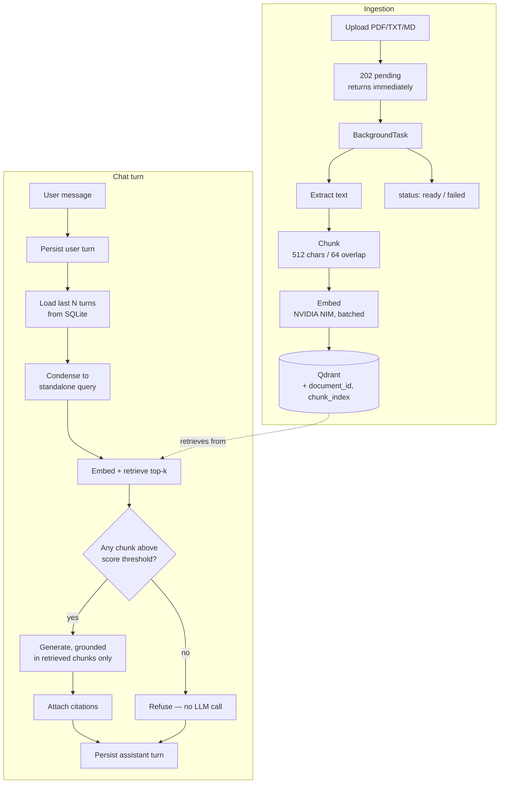

# KnowledgeHub

Multi-document RAG assistant with conversational memory and source-grounded citations.

Upload documents, ask questions in a natural back-and-forth, and get answers that cite
the exact chunk they came from. Follow-up questions work — "what about pricing?" resolves
against what you were just discussing. Questions the documents don't cover are refused
rather than answered from the model's own knowledge.

---

## Quickstart

```bash
cp .env.example .env    # add your free NVIDIA API key from build.nvidia.com
docker compose up --build
```

Frontend at http://localhost:3000, API docs at http://localhost:8000/docs.

`NVIDIA_API_KEY` is the only required variable. Everything else has working defaults.

---

## The core problem: follow-up questions

A conversational RAG system has one hard problem that single-turn Q&A doesn't. Given:

> **User:** What services does Acme Cloud Platform offer?
> **User:** What about pricing?

Embedding "What about pricing?" and searching the vector store retrieves *some* document's
pricing section — quite possibly the wrong one. The question is meaningless on its own.

KnowledgeHub resolves this with a **condensation step**: before retrieval, a cheap LLM call
rewrites the follow-up into a standalone query using the conversation history.

| User says | Retrieval actually runs on |
|---|---|
| "What about pricing?" | "What is the pricing of Acme Cloud Platform?" |
| "And what about Zenith? How much is it?" | "What is the pricing of Zenith?" |

The condensed query is **persisted on every assistant message** and surfaced in the UI
("Retrieved using: …"). That makes the memory mechanism inspectable instead of implicit —
you can see exactly what the system understood you to be asking, and the eval suite asserts
on it directly.

### Two failure modes this had to survive

Both were found during development and drove design decisions:

**1. The condenser inventing relationships.** Asking "and what about Zenith?" after
discussing Acme originally condensed to *"the pricing of Zenith, a service offered by Acme
Cloud Platform"* — a fabricated relationship that poisoned retrieval and produced a
confidently wrong "no information available" answer. The condensation prompt now explicitly
instructs that a newly named subject **replaces** the previous topic rather than nesting
under it.

**2. Generating on the raw message.** The generation step originally received the user's
original wording so answers would read naturally. But generation gets no conversation
history — only the retrieved chunks — so "and what about Zenith?" read as unanswerable
*even when the correct chunks had been retrieved*. Generation now runs on the condensed
query. The relevant invariant: **anything downstream of condensation that lacks history
must consume the condensed form.**

---

## Architecture



### Stack

| Layer | Choice | Why |
|---|---|---|
| Frontend | Next.js 15 (App Router), Tailwind 4 | App Router's async params and streaming fit an SSE chat UI |
| Backend | FastAPI, Python 3.11 | Async-native; 3.11 pinned because several transitive deps lack wheels on newer interpreters |
| Vector DB | Qdrant (self-hosted) | Runs in the Compose stack — no account, no API key, no external dependency during a demo |
| Relational DB | SQLite | Conversation history needs a real DB; SQLite needs zero infra. `DATABASE_URL` swaps in Postgres unchanged |
| Embeddings | NVIDIA NIM `llama-nemotron-embed-1b-v2` | Free hosted tier, 2048-dim, no local GPU |
| LLM | NVIDIA NIM `meta/llama-3.1-8b-instruct` | Free hosted inference; `LLM_PROVIDER=ollama` switches to local for offline dev |

---

## Design decisions

**Hand-rolled condensation instead of LangChain's `ConversationalRetrievalChain.`**
The chain bundles condensation, retrieval and generation behind one interface. Condensation
is the highest-risk component here, and its output is the single most useful debugging and
eval artifact — worth keeping as an explicit, storable, separately-tunable step. The two bugs
above were both diagnosed by reading persisted condensed queries; inside a bundled chain
they would have surfaced only as vaguely worse answers. LangChain is still used for
`RecursiveCharacterTextSplitter` and the NVIDIA integrations, where the abstraction earns its keep.

**Two-layer refusal.** Layer 1 is structural: if no chunk clears the similarity threshold, the
system returns a canned refusal and *never calls the generation model* — a model that is never
invoked cannot hallucinate. Layer 2 is the grounding constraint in the generation prompt, which
catches the subtler case where chunks are retrieved and plausibly relevant but don't actually
answer the question.

**Deterministic citations.** Citations are built from the chunks passed into the context
window, not parsed out of the model's output. Asking the LLM to self-report its sources adds
a failure mode (and often a second call) for information already known exactly.

**Relevance decides what the model sees; the document decides what order it reads.**
Retrieval returns chunks ranked by score, which scrambles any document whose meaning depends
on sequence. Testing against a real résumé, the model was asked for education and answered
with three degrees — one of which didn't exist. The EDUCATION section straddled a chunk
boundary, so `MIT ADT University, Pune 2024-2026` sat at the end of one chunk and the degree
line it belongs to at the start of the next; delivered in relevance order the model paired
each degree with the wrong university and invented a third. Context is now sorted back into
`(document_id, chunk_index)` order before generation, while citations stay ranked by
relevance. Chunk size also moved from 512/64 to 1024/128: 512 was carried over from a
prose-PDF project and splits structured documents mid-record.

**Two thresholds, not one.** Deciding *"is this answerable?"* and *"is this chunk worth
including?"* are different questions, and one number answered both badly. A single 0.25 bar
tuned to reject nonsense also discarded the résumé chunk containing the education section —
it scored 0.204, well below the header block's 0.464 — so the system confidently reported
information it was holding. Refusal is now judged on the **top hit only**
(`refusal_score_threshold`, 0.20), while supporting chunks need only clear a much lower
`context_score_floor` (0.05). Measured on the corpus, in-corpus questions score 0.445-0.503
at the top hit and out-of-corpus 0.024-0.114, so the refusal bar sits in a wide empty gap
rather than being fitted to a single example.

**Duplicate passages are collapsed before they reach the model.** Uploading the same file
twice is an ordinary thing to do, and it produces two `document_id`s over identical text —
so top-k fills with the same passage twice, the model re-reads it, the citation list repeats
itself, and half the context budget buys nothing. Retrieval over-fetches, deduplicates on the
chunk text (not on `(document_id, chunk_index)`, which would miss copies *across* documents),
then trims to the configured budget.

**Suggested starter questions use the document's own title, not its filename.**
Filenames are a poor stand-in for content: a résumé named `candidate-profile.pdf` or
`resume-ai.pdf` never contains the phrase "candidate profile" anywhere in its own text, so a
filename-derived starter like "What is candidate profile about?" scored nowhere near the
refusal threshold — retrieval was correctly refusing a query about content that genuinely
isn't there. Every document seen so far puts its real subject on the first non-empty line —
a person's name, or a `# Title` heading — with contact details or body text after it, not
before. `derive_document_title` takes that line at ingestion time and it's stored on every
chunk's Qdrant payload (not a new SQL column — no migration needed, same reasoning as the
conversation list's computed fields) and looked up once a document reaches `ready`. Verified
directly against retrieval scores, not just the button label: "What is candidate profile
about?" tops out at 0.09 (refused); "What is Priya Nair about?" tops out at 0.43 (answered).

**Ingestion returns before it finishes.** Upload inserts a row, schedules a `BackgroundTask`,
and returns `pending` immediately; the task advances the row through `processing` →
`ready`/`failed` and the UI polls. A 200-page PDF would otherwise block the request past any
sane timeout. Partial vectors are cleaned up on failure so a retry can't double-write.

Concurrent ingestion made this racy in a way that only reproduced on a *completely empty*
vector store: two documents uploaded together both checked for the Qdrant collection, both
found it missing, and both tried to create it — the loser got a 409 and its document went
`failed`. Since that state only exists on a reviewer's very first run, it survived every
test until the stack was torn down with `docker compose down -v` and rebuilt from nothing.
Collection creation now treats "already exists" as success and re-raises anything else.
Worth stating plainly: the eval suite caught this, having passed 6/6 minutes earlier against
a warm store.

**Condensation is skipped on the first turn.** With no history there is nothing to resolve, so
the LLM call is skipped entirely rather than made and discarded.

---

## Evaluation

Ten cases, deterministic substring assertions, no LLM judge — fast, free, and reproducible.

```bash
python evals/eval_pipeline.py    # ingests the corpus if needed, then runs
```

Each case declares its checks explicitly, because a presence-only faithfulness metric is
what let real bugs ship past the first version of this suite:

- **`expected_all`** — every term must appear. Catches terse answers. `"AI Software
  Engineer."` was once a whole answer to "describe him"; a completeness check rejects it.
- **`forbidden`** — no term may appear. Catches hallucinated facts and cross-document
  contamination — things a keyword-presence check can't see, because you can't assert the
  *presence* of a fact you didn't expect.
- **`expected_source`** — the document a correct answer must cite. A system with broken
  memory still returns a fluent pricing answer to "what about pricing?"; it just cites the
  wrong document, so which document is cited is tracked per-case.
- **`expect_no_citations`** — the structural refusal signal. The refusal short-circuit
  returns *before* the generation call, so a real refusal cannot carry sources. Asserting
  only the wording let a regression that answered *with* citations pass, provided the text
  contained a hedging word.

**Terms match on alphanumeric boundaries, not raw substrings.** Naive `in` made short terms
nearly unfalsifiable: `"SQL"` was satisfied by `"PostgreSQL"` — which the résumé fixture
contains — `"Go"` by `"going"`, and `"not"` by `"note"`. The completeness check could
therefore pass on an answer that never contained the fact, which is precisely the failure
this harness exists to catch. `\b` would have been the wrong tool, since several terms are
numeric (`99.95`, `0.000024`): boundary assertions on alphanumerics let `$45` and `45%`
satisfy `45` while `1945` does not.

**Retrieval precision 100% · Completeness 100% · Contamination-free 100% · 10/10 passed**

| Case | What it guards |
|---|---|
| single-turn: specific figure / second document | basic grounded retrieval |
| completeness: all three services | terse-answer regression (`expected_all`) |
| pdf: extraction and a specific fact | the PDF parse path (corpus was markdown-only) |
| pdf: education pairing (two degrees, two universities) | multi-chunk recall + correct pairing |
| no contamination: skills stay within the resume | cross-document bleed (`forbidden`) |
| follow-up: bare pronoun-style follow-up | memory must be **applied** |
| follow-up: topic switch to the other document | memory must be **displaced** |
| follow-up: switch to the resume person, then education | memory across a document boundary |
| refusal: out of corpus | no hallucination when nothing is retrieved |

The corpus is three documents. Two (`acme-cloud-platform.md`, `zenith-analytics-suite.md`)
have **deliberately parallel structure** — both have Services and Pricing sections — so a
bare "what about pricing?" is genuinely ambiguous and only resolves if conversation history
reached the retrieval query. The third (`candidate-profile.pdf`) is a **structured PDF**: a
fictional résumé whose education section carries two degrees at two universities. It exists
because every earlier eval was clean markdown, and the two worst production bugs — a dropped
low-scoring chunk and mis-paired degrees — were PDF-and-structure specific. It's generated
from `evals/corpus_src/make_resume_pdf.py` (fpdf2, regeneration only) and committed as a
binary fixture.

The follow-up cases test opposite failure directions: one needs memory **applied**, one
needs it **displaced**. Asserting only the first would let the "invented relationship" bug
(condensation attaching the previous topic to a new subject) ship.

**The harness has verified teeth.** `tests/test_eval_checks.py` feeds the check functions the
actual buggy answers observed during development — the terse `"AI Software Engineer."`, a
hallucinated third degree, a contaminated skills answer — and asserts each is rejected. That
way the suite's ability to catch a regression doesn't rest on reproducing an LLM's
nondeterministic output. It also pins the substring-collision cases, since those were a
false-pass the harness itself shipped with: the tests assert that `"PostgreSQL"` does *not*
satisfy `"SQL"`, that `"going"` does not satisfy `"Go"`, and that `"1945"` does not
satisfy `"45"` — while the genuine occurrences still match.

**A note on re-running.** `ingest_corpus` treats a document as present only once it reaches
`ready`, and deletes and re-uploads anything left `failed`. Skipping on filename alone meant
a document lost to a transient embedding error was never retried, so the suite ran against an
incomplete corpus and reported retrieval failures that pointed at the retrieval logic rather
than at the missing file.

---

## API

| Method | Endpoint | Purpose |
|---|---|---|
| `POST` | `/api/documents` | Upload; returns immediately with `status: pending` |
| `GET` | `/api/documents` | List with ingestion status and chunk counts |
| `GET` | `/api/documents/{id}` | Single document — poll this for status |
| `DELETE` | `/api/documents/{id}` | Remove document and its vectors |
| `POST` | `/api/conversations` | Start a conversation |
| `GET` | `/api/conversations` | List with `last_message_at` + `message_count`, newest activity first |
| `DELETE` | `/api/conversations/{id}` | Remove a conversation and its messages |
| `POST` | `/api/conversations/{id}/messages` | Send a message, get the full answer |
| `POST` | `/api/conversations/{id}/messages/stream` | Same, streamed token-by-token over SSE |
| `GET` | `/api/conversations/{id}/messages` | Full thread with citations |
| `GET` | `/health` | Health check |

Errors are structured, never bare 500s: 400 for invalid uploads, 404 for unknown ids,
422 with field details for validation failures.

### Streaming

`/messages/stream` emits SSE frames: `condensed_query` (so the UI can show what retrieval
ran on before any tokens arrive), then `token` per generated token, then `citations`, then
`done`. The assistant message is persisted after the stream completes, so a dropped
connection can't leave a half-written turn in the thread.

---

## Local development

Backend:
```bash
cd knowledgehub-backend
python3.11 -m venv venv && source venv/bin/activate
pip install -r requirements.txt
cp .env.example .env      # add NVIDIA_API_KEY
docker run -d -p 6333:6333 qdrant/qdrant
uvicorn app.main:app --reload --port 8000
```

Frontend:
```bash
cd knowledgehub-frontend
npm install
npm run dev               # http://localhost:3005
```

Tests:
```bash
cd knowledgehub-backend && pytest        # 67 tests
```

---

## Interface

One page, three panes: chat history left, conversation centre, ingested documents right.
Below 1280px the documents pane collapses to a toggle; below 1024px both become slide-over
drawers. There is no second route — but the selected conversation lives in the URL as
`/?c=<id>`, so refresh, back/forward and link-sharing still work. Collapsing to a single
page shouldn't cost addressability.

Three decisions worth naming:

- **Conversations are created on first send, not on "New chat".** Eagerly POSTing a
  conversation when the button is clicked leaves an empty untitled row behind every time
  someone opens the app and changes their mind.
- **Threads name themselves** from the first user message, and never rename after. A title
  that changed every turn would be unfindable.
- **The condensed query is shown in the UI**, under each answer. It's the one piece of the
  memory mechanism a user can otherwise only infer, and it makes a wrong retrieval legible
  instead of mysterious.

Verified at 1440/1280/768/375, in light and dark, with a keyboard-only pass. Every text
element in both themes clears WCAG AA contrast (checked programmatically, not by eye —
`--text-subtle` had to be darkened after measuring 4.37:1 on the *selected* sidebar row,
which is tinted, even though it passed against the page background).

---

## Data model

```
documents      id, filename, stored_path, content_type,
               status (pending|processing|ready|failed), status_detail,
               chunk_count, created_at, updated_at

conversations  id, title, created_at
               (last_message_at + message_count are computed per request,
                not stored — create_all() can't add columns to an existing
                SQLite file and this project ships without migrations)

messages       id, conversation_id, role, content,
               citations (JSON), condensed_query, created_at
```

`documents.status` doubles as the ingestion job tracker — a separate jobs table would be
extra machinery for state that already has an obvious home. `messages.condensed_query`
exists purely for debuggability and evals; it isn't needed to serve a response.

---

## Deliberately not built

- **Auth** — single-tenant demo. No signal value here relative to the time cost.
- **Hybrid search / reranking** — a sibling project of mine (ContextQuery) implemented BM25
  + reciprocal-rank-fusion alongside semantic search and evaluated both; hybrid did not
  reliably beat semantic-only on a small corpus. Re-running that experiment blind on an
  equally small corpus would produce no new information, so semantic-only is used and the
  prior finding is cited rather than repeated.
- **Conversation summarisation for long histories** — last N turns verbatim. Summarising
  older turns is real production hardening but isn't needed to demonstrate the mechanism.
- **Alembic migrations** — `create_all()` on startup. Correct for a single-environment demo;
  the first schema change in a real deployment would need migrations.
- **CI pipeline** — tests and evals run locally with one command.

## Known limitations

- Scanned/image-only PDFs fail ingestion (no OCR) — surfaced as `failed` with a reason
  rather than silently ingesting an empty document.
- `BackgroundTasks` runs in-process: ingestion restarts are lost if the container dies
  mid-job. A durable queue is the right answer beyond demo scale.
- The similarity thresholds are tuned against this corpus and embedding model. They are
  genuine precision/recall dials, not universal constants — a different embedding model
  produces a different score distribution and would need re-measuring, which is why the
  observed in-corpus/out-of-corpus ranges are written down above rather than just the values.
- Chunking is fixed-size, so a section longer than 1024 characters still splits. Layout-aware
  chunking (splitting on document structure rather than character count) is the real fix for
  structured documents like resumes; narrative ordering mitigates it rather than solving it.
