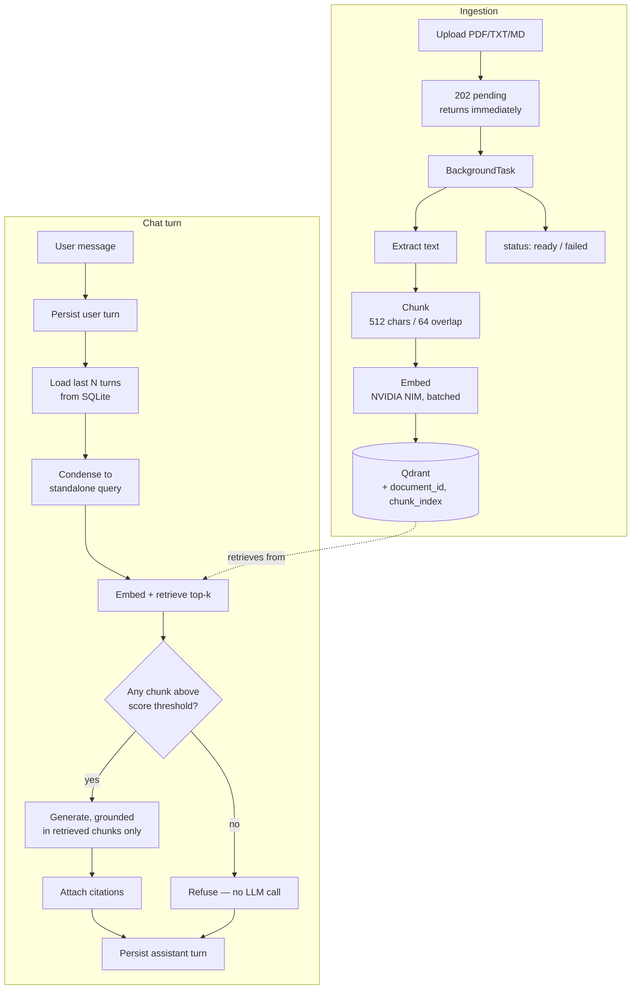

# KnowledgeHub

Multi-document RAG assistant with conversational memory and source-grounded citations.

Upload documents, ask questions in a natural back-and-forth, and get answers that cite
the exact chunk they came from. Follow-up questions work — "what about pricing?" resolves
against what you were just discussing. Questions the documents don't cover are refused
rather than answered from the model's own knowledge.

---

## Quickstart

```bash
cp .env.example .env    # add your free NVIDIA API key from build.nvidia.com
docker compose up --build
```

Frontend at http://localhost:3000, API docs at http://localhost:8000/docs.

`NVIDIA_API_KEY` is the only required variable. Everything else has working defaults.

---

## The core problem: follow-up questions

A conversational RAG system has one hard problem that single-turn Q&A doesn't. Given:

> **User:** What services does Acme Cloud Platform offer?
> **User:** What about pricing?

Embedding "What about pricing?" and searching the vector store retrieves *some* document's
pricing section — quite possibly the wrong one. The question is meaningless on its own.

KnowledgeHub resolves this with a **condensation step**: before retrieval, a cheap LLM call
rewrites the follow-up into a standalone query using the conversation history.

| User says | Retrieval actually runs on |
|---|---|
| "What about pricing?" | "What is the pricing of Acme Cloud Platform?" |
| "And what about Zenith? How much is it?" | "What is the pricing of Zenith?" |

The condensed query is **persisted on every assistant message** and surfaced in the UI
("Retrieved using: …"). That makes the memory mechanism inspectable instead of implicit —
you can see exactly what the system understood you to be asking, and the eval suite asserts
on it directly.

### Two failure modes this had to survive

Both were found during development and drove design decisions:

**1. The condenser inventing relationships.** Asking "and what about Zenith?" after
discussing Acme originally condensed to *"the pricing of Zenith, a service offered by Acme
Cloud Platform"* — a fabricated relationship that poisoned retrieval and produced a
confidently wrong "no information available" answer. The condensation prompt now explicitly
instructs that a newly named subject **replaces** the previous topic rather than nesting
under it.

**2. Generating on the raw message.** The generation step originally received the user's
original wording so answers would read naturally. But generation gets no conversation
history — only the retrieved chunks — so "and what about Zenith?" read as unanswerable
*even when the correct chunks had been retrieved*. Generation now runs on the condensed
query. The relevant invariant: **anything downstream of condensation that lacks history
must consume the condensed form.**

---

## Architecture



### Stack

| Layer | Choice | Why |
|---|---|---|
| Frontend | Next.js 15 (App Router), Tailwind 4 | App Router's async params and streaming fit an SSE chat UI |
| Backend | FastAPI, Python 3.11 | Async-native; 3.11 pinned because several transitive deps lack wheels on newer interpreters |
| Vector DB | Qdrant (self-hosted) | Runs in the Compose stack — no account, no API key, no external dependency during a demo |
| Relational DB | SQLite | Conversation history needs a real DB; SQLite needs zero infra. `DATABASE_URL` swaps in Postgres unchanged |
| Embeddings | NVIDIA NIM `llama-nemotron-embed-1b-v2` | Free hosted tier, 2048-dim, no local GPU |
| LLM | NVIDIA NIM `meta/llama-3.1-8b-instruct` | Free hosted inference; `LLM_PROVIDER=ollama` switches to local for offline dev |

---

## Design decisions

**Hand-rolled condensation instead of LangChain's `ConversationalRetrievalChain.`**
The chain bundles condensation, retrieval and generation behind one interface. Condensation
is the highest-risk component here, and its output is the single most useful debugging and
eval artifact — worth keeping as an explicit, storable, separately-tunable step. The two bugs
above were both diagnosed by reading persisted condensed queries; inside a bundled chain
they would have surfaced only as vaguely worse answers. LangChain is still used for
`RecursiveCharacterTextSplitter` and the NVIDIA integrations, where the abstraction earns its keep.

**Two-layer refusal.** Layer 1 is structural: if no chunk clears the similarity threshold, the
system returns a canned refusal and *never calls the generation model* — a model that is never
invoked cannot hallucinate. Layer 2 is the grounding constraint in the generation prompt, which
catches the subtler case where chunks are retrieved and plausibly relevant but don't actually
answer the question.

**Deterministic citations.** Citations are built from the chunks passed into the context
window, not parsed out of the model's output. Asking the LLM to self-report its sources adds
a failure mode (and often a second call) for information already known exactly.

**Ingestion returns before it finishes.** Upload inserts a row, schedules a `BackgroundTask`,
and returns `pending` immediately; the task advances the row through `processing` →
`ready`/`failed` and the UI polls. A 200-page PDF would otherwise block the request past any
sane timeout. Partial vectors are cleaned up on failure so a retry can't double-write.

Concurrent ingestion made this racy in a way that only reproduced on a *completely empty*
vector store: two documents uploaded together both checked for the Qdrant collection, both
found it missing, and both tried to create it — the loser got a 409 and its document went
`failed`. Since that state only exists on a reviewer's very first run, it survived every
test until the stack was torn down with `docker compose down -v` and rebuilt from nothing.
Collection creation now treats "already exists" as success and re-raises anything else.
Worth stating plainly: the eval suite caught this, having passed 6/6 minutes earlier against
a warm store.

**Condensation is skipped on the first turn.** With no history there is nothing to resolve, so
the LLM call is skipped entirely rather than made and discarded.

---

## Evaluation

Six cases, deterministic substring assertions, no LLM judge — fast, free, and reproducible.
The tradeoff is brittleness to phrasing, so expected values are pipe-separated alternatives.

```bash
python evals/eval_pipeline.py    # ingests the corpus if needed, then runs
```

| Case | Retrieval | Faithful |
|---|---|---|
| single-turn: services | PASS | PASS |
| single-turn: specific figure | PASS | PASS |
| single-turn: second document | PASS | PASS |
| **follow-up: bare pronoun-style follow-up** | PASS | PASS |
| **follow-up: topic switch to the other document** | PASS | PASS |
| refusal: out of corpus | n/a | PASS |

**Retrieval precision 100% · Faithfulness 100% · 6/6 passed**

The eval corpus is two documents with **deliberately parallel structure** — both
`acme-cloud-platform.md` and `zenith-analytics-suite.md` have "Services" and "Pricing"
sections. That parallelism is the point: a bare "what about pricing?" is genuinely ambiguous
across the corpus, so the case can only pass if conversation history reached the retrieval
query. A system with broken memory still returns a fluent, plausible pricing answer here —
it just cites the wrong document. Measuring which document was cited is what separates the
two, which is why retrieval precision is tracked per-case rather than only faithfulness.

The two follow-up cases test opposite failure directions: one requires memory to be
**applied** (bare follow-up), the other requires it to be **displaced** (topic switch).
Only asserting the first would let the "invented relationship" bug ship.

---

## API

| Method | Endpoint | Purpose |
|---|---|---|
| `POST` | `/api/documents` | Upload; returns immediately with `status: pending` |
| `GET` | `/api/documents` | List with ingestion status and chunk counts |
| `GET` | `/api/documents/{id}` | Single document — poll this for status |
| `DELETE` | `/api/documents/{id}` | Remove document and its vectors |
| `POST` | `/api/conversations` | Start a conversation |
| `GET` | `/api/conversations` | List conversations |
| `POST` | `/api/conversations/{id}/messages` | Send a message, get the full answer |
| `POST` | `/api/conversations/{id}/messages/stream` | Same, streamed token-by-token over SSE |
| `GET` | `/api/conversations/{id}/messages` | Full thread with citations |
| `GET` | `/health` | Health check |

Errors are structured, never bare 500s: 400 for invalid uploads, 404 for unknown ids,
422 with field details for validation failures.

### Streaming

`/messages/stream` emits SSE frames: `condensed_query` (so the UI can show what retrieval
ran on before any tokens arrive), then `token` per generated token, then `citations`, then
`done`. The assistant message is persisted after the stream completes, so a dropped
connection can't leave a half-written turn in the thread.

---

## Local development

Backend:
```bash
cd knowledgehub-backend
python3.11 -m venv venv && source venv/bin/activate
pip install -r requirements.txt
cp .env.example .env      # add NVIDIA_API_KEY
docker run -d -p 6333:6333 qdrant/qdrant
uvicorn app.main:app --reload --port 8000
```

Frontend:
```bash
cd knowledgehub-frontend
npm install
npm run dev               # http://localhost:3005
```

Tests:
```bash
cd knowledgehub-backend && pytest        # 14 tests
```

---

## Data model

```
documents      id, filename, stored_path, content_type,
               status (pending|processing|ready|failed), status_detail,
               chunk_count, created_at, updated_at

conversations  id, title, created_at

messages       id, conversation_id, role, content,
               citations (JSON), condensed_query, created_at
```

`documents.status` doubles as the ingestion job tracker — a separate jobs table would be
extra machinery for state that already has an obvious home. `messages.condensed_query`
exists purely for debuggability and evals; it isn't needed to serve a response.

---

## Deliberately not built

- **Auth** — single-tenant demo. No signal value here relative to the time cost.
- **Hybrid search / reranking** — a sibling project of mine (ContextQuery) implemented BM25
  + reciprocal-rank-fusion alongside semantic search and evaluated both; hybrid did not
  reliably beat semantic-only on a small corpus. Re-running that experiment blind on an
  equally small corpus would produce no new information, so semantic-only is used and the
  prior finding is cited rather than repeated.
- **Conversation summarisation for long histories** — last N turns verbatim. Summarising
  older turns is real production hardening but isn't needed to demonstrate the mechanism.
- **Alembic migrations** — `create_all()` on startup. Correct for a single-environment demo;
  the first schema change in a real deployment would need migrations.
- **CI pipeline** — tests and evals run locally with one command.

## Known limitations

- Scanned/image-only PDFs fail ingestion (no OCR) — surfaced as `failed` with a reason
  rather than silently ingesting an empty document.
- `BackgroundTasks` runs in-process: ingestion restarts are lost if the container dies
  mid-job. A durable queue is the right answer beyond demo scale.
- The similarity threshold (0.25) is tuned against this corpus and embedding model. It is a
  genuine precision/recall dial, not a universal constant — too high refuses answerable
  questions, too low lets weak context through to generation.
